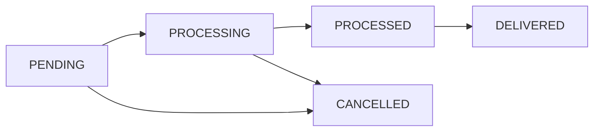

# 🍔 Food Delivery Order Service

A **scalable backend service** for processing food delivery orders, built with **Java, Spring Boot, MySQL, and async processing**.  
Designed with **clean architecture, robust error handling, and real-world order workflows**.

---

## ✨ Features

- ✅ **RESTful API** for order management
- ⚡ **Asynchronous order processing** with in-memory queue
- 🗄️ **MySQL database** with optimized queries & indexing
- 📑 **Pagination** support for fetching orders
- 🛡️ **Validation & exception handling** with consistent JSON responses
- 🏗️ **Service layer abstraction** with DTOs & mappers
- 🔄 **Background consumer** for auto-processing orders
- 🧹 **Spring Boot best practices** and clean codebase

---

## 🛠️ Tech Stack

  
  
  
  


---

## 📂 Project Structure
```bash
food-delivery-service/
├── src/main/java/com/foodorderservice/Foodie
│   ├── controller/        # REST controllers
│   ├── service/           # Business logic
│   ├── repository/        # Data access layer
│   ├── entity/            # JPA entities
│   ├── dtos/              # Data transfer objects
│   ├── mapper/            # Entity-DTO mappers
│   ├── config/            # Configurations
│   ├── advices/           # Response advices & Global exception handler
│   ├── exception/         # Custom exceptions
│   └── FoodApplication.java
├── src/main/resources/
│   └── application.properties   # App config
├── pom.xml
└── README.md
```

---

## ⚙️ Prerequisites

- ☕ Java 17
- 📦 Maven 3.6+
- 🗄️ MySQL 8.0+
- 🌀 Git

---

## 🚀 Setup Instructions

### 1️⃣ Clone the Repository
```bash
git clone https://github.com/git-Sankalp-Agarwal/Foodie-App
cd Foodie-App
```

### 2️⃣ Configure Database
Update `application.yml` or `application.properties` with your credentials:
```properties
spring.datasource.url=jdbc:mysql://localhost:3306/foodie_db?createDatabaseIfNotExist=true&useSSL=false&serverTimezone=UTC
spring.datasource.username=your_username
spring.datasource.password=your_password
```

### 3️⃣ Build & Run
```bash
mvn clean install
mvn spring-boot:run
```

Or run the JAR:
```bash
java -jar target/foodie-app-1.0.0.jar
```

👉 The service runs at: `http://localhost:8080`

---

## 📖 API Documentation

### Available Endpoints
| Method | Endpoint                  | Description             |
|--------|---------------------------|-------------------------|
| **POST**   | `/api/orders`             | Create a new order      |
| **GET**    | `/api/orders`             | Get all orders (paginated) |
| **GET**    | `/api/orders/{id}`        | Get order by ID         |
| **GET**    | `/api/orders/{id}/status` | Get order status        |
| **PATCH**  | `/api/orders/{id}/status` | Update order status     |

📌 Swagger / OpenAPI docs will be available at:  
`http://localhost:8080/swagger-ui.html` or `/swagger-ui/index.html`

---

## 🍽️ API Usage Examples

<details>
<summary><b>▶️ Create Order</b></summary>

**POST** `http://localhost:8080/api/orders`

**Request JSON:**
```json
{
  "customerName": "Alice Johnson",
  "items": [
    {
      "itemName": "Burger",
      "quantity": 2,
      "price": 8.99
    },
    {
      "itemName": "Fries",
      "quantity": 1,
      "price": 3.99
    },
    {
      "itemName": "Coke",
      "quantity": 2,
      "price": 2.50
    }
  ],
  "totalAmount": 26.97
}

✅ **Successful response (201 Created)**
```json
{
  "success": true,
  "message": "Order created successfully",
  "timeStamp": "2025-09-14T11:17:33.3697473",
  "data": {
    "id": 4,
    "customerName": "Alice Johnson",
    "totalAmount": 26.97,
    "status": "PENDING",
    "orderTime": "2025-09-14T11:17:33.215756",
    "processedTime": null,
    "items": [
      {
        "itemName": "Burger",
        "quantity": 2,
        "price": 8.99
      },
      {
        "itemName": "Fries",
        "quantity": 1,
        "price": 3.99
      },
      {
        "itemName": "Coke",
        "quantity": 2,
        "price": 2.50
      }
    ]
  }
}
```

❌ **Validation error (400 Bad Request)**
```json
{
  "success": false,
  "message": "Invalid order state",
  "timeStamp": "2025-09-14T11:15:15.2112686",
  "error": {
    "status": "BAD_REQUEST",
    "message": "Invalid order state",
    "subErrors": [
      "Total amount does not match sum of items"
    ]
  }
}
```
</details>

<details>
<summary><b>▶️ Get Order by ID</b></summary>

**GET** `/api/orders/1`

✅ **Success (200)**
```json
{
  "success": true,
  "message": "Order retrieved successfully",
  "timeStamp": "2025-09-14T11:18:10.4862606",
  "data": {
    "id": 3,
    "customerName": "Bob Johnson",
    "totalAmount": 42.00,
    "status": "DELIVERED",
    "orderTime": "2025-09-14T14:47:00",
    "processedTime": null,
    "items": [
      {
        "itemName": "Pasta",
        "quantity": 2,
        "price": 12.99
      },
      {
        "itemName": "Garlic Bread",
        "quantity": 1,
        "price": 4.99
      },
      {
        "itemName": "Ice Cream",
        "quantity": 2,
        "price": 5.50
      }
    ]
  }
}
```
</details>

<details>
<summary><b>▶️ Get All Orders (Paginated)</b></summary>

**GET** `http://localhost:8080/api/orders?page=0&size=10&sortBy=orderTime&sortDirection=DESC`

✅ **Response (200)**
```json
{
  "success": true,
  "message": "Orders retrieved successfully",
  "timeStamp": "2025-09-14T11:18:38.9136543",
  "data": {
    "content": [
      {
        "id": 1,
        "customerName": "John Doe",
        "totalAmount": 25.99,
        "status": "PENDING",
        "orderTime": "2025-09-14T16:47:00",
        "processedTime": null,
        "items": [
          {
            "itemName": "Burger",
            "quantity": 2,
            "price": 8.99
          },
          {
            "itemName": "Fries",
            "quantity": 1,
            "price": 3.99
          },
          {
            "itemName": "Coke",
            "quantity": 2,
            "price": 2.50
          }
        ]
      },
      {
        "id": 2,
        "customerName": "Jane Smith",
        "totalAmount": 35.50,
        "status": "PROCESSED",
        "orderTime": "2025-09-14T15:47:00",
        "processedTime": null,
        "items": [
          {
            "itemName": "Pizza",
            "quantity": 1,
            "price": 15.99
          },
          {
            "itemName": "Salad",
            "quantity": 1,
            "price": 7.99
          },
          {
            "itemName": "Juice",
            "quantity": 2,
            "price": 3.50
          }
        ]
      },
      {
        "id": 3,
        "customerName": "Bob Johnson",
        "totalAmount": 42.00,
        "status": "DELIVERED",
        "orderTime": "2025-09-14T14:47:00",
        "processedTime": null,
        "items": [
          {
            "itemName": "Pasta",
            "quantity": 2,
            "price": 12.99
          },
          {
            "itemName": "Garlic Bread",
            "quantity": 1,
            "price": 4.99
          },
          {
            "itemName": "Ice Cream",
            "quantity": 2,
            "price": 5.50
          }
        ]
      },
      {
        "id": 4,
        "customerName": "Alice Johnson",
        "totalAmount": 26.97,
        "status": "PROCESSED",
        "orderTime": "2025-09-14T11:17:33",
        "processedTime": "2025-09-14T11:17:35",
        "items": [
          {
            "itemName": "Burger",
            "quantity": 2,
            "price": 8.99
          },
          {
            "itemName": "Fries",
            "quantity": 1,
            "price": 3.99
          },
          {
            "itemName": "Coke",
            "quantity": 2,
            "price": 2.50
          }
        ]
      }
    ],
    "pageNumber": 0,
    "pageSize": 10,
    "totalElements": 4,
    "totalPages": 1,
    "first": true,
    "last": true
  }
}
```
</details>

<details>
<summary><b>▶️ Get Order Status</b></summary>

**GET** `http://localhost:8080/api/orders/1/status`
✅ **Response (200)**
```json
{
  "success": true,
  "message": "Order status retrieved successfully",
  "timeStamp": "2025-09-14T14:17:54.09427",
  "data": {
    "orderId": 1,
    "status": "PROCESSED",
    "orderTime": "2025-09-14T13:27:08",
    "processedTime": "2025-09-14T13:27:13"
  }
}
```
</details>


<details>
<summary><b>▶️ Update Order Status</b></summary>

**PATCH** `http://localhost:8080/api/orders/1/status`
```json
{ "status": "CANCELLED" }
```
✅ **Response (200)**
```json
{
  "success": true,
  "message": "Order status updated successfully",
  "timeStamp": "2025-09-14T11:25:35.3492948",
  "data": {
    "id": 10,
    "customerName": "Ravi Johnson",
    "totalAmount": 26.97,
    "status": "CANCELLED",
    "orderTime": "2025-09-14T11:25:30",
    "processedTime": null,
    "items": [
      {
        "itemName": "Pizze",
        "quantity": 2,
        "price": 8.99
      },
      {
        "itemName": "Roll",
        "quantity": 1,
        "price": 3.99
      },
      {
        "itemName": "Sprite",
        "quantity": 2,
        "price": 2.50
      }
    ]
  }
}
```
</details>

---

## 🔄 Order Status Flow



---

## ⚡ Asynchronous Processing

- Orders are added to an **in-memory queue**
- Orders initial status → **PENDING**
- A background consumer processes them, moving them from  
  `PENDING → PROCESSING → PROCESSED`
- Simulates ~5s delay to mimic real-world behavior.

---

## 🚨 Error Handling

- `400 Bad Request` → Validation failures
- `404 Not Found` → Order not found
- `500 Internal Server Error` → Unexpected errors

📦 All errors return a **consistent JSON format** with `success=false`, `message`, and `error` details.

All errors follow consistent JSON response format:
```json
{
  "success": false,
  "message": "An unexpected error occurred",
  "timeStamp": "2025-09-14T11:26:19.292407",
  "error": {
    "status": "INTERNAL_SERVER_ERROR",
    "message": "An unexpected error occurred",
    "subErrors": [
      "JSON parse error: Cannot deserialize value of type `com.foodorderservice.Foodie.entity.enums.OrderStatus` from String \"CANCsELLED\": not one of the values accepted for Enum class: [CANCELLED, PROCESSING, DELIVERED, PROCESSED, PENDING]"
    ]
  }
}
```
---

## 📬 Contact

👤 **Sankalp**  
📧 Email: [sankalpagarwal1304@gmail.com](mailto:sankalpagarwal1304@gmail.com)  
🔗 GitHub: [Foodie-App](https://github.com/git-Sankalp-Agarwal/Foodie-App)  

---
