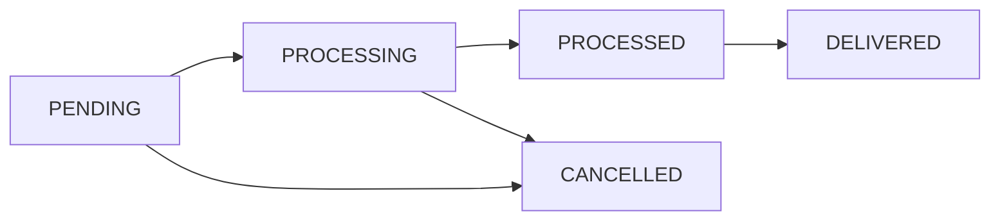

# 🍔 Food Delivery Order Service

A **scalable backend service** for processing food delivery orders, built with **Java, Spring Boot, MySQL, and async processing**.  
Designed with **clean architecture, robust error handling, and real-world order workflows**.

---

## ✨ Features

- ✅ **RESTful API** for order management
- ⚡ **Asynchronous order processing** with in-memory queue
- 🗄️ **MySQL database** with optimized queries & indexing
- 📑 **Pagination** support for fetching orders
- 🛡️ **Validation & exception handling** with consistent JSON responses
- 🏗️ **Service layer abstraction** with DTOs & mappers
- 🔄 **Background consumer** for auto-processing orders
- 🧹 **Spring Boot best practices** and clean codebase

---

## 🛠️ Tech Stack

  
  
  
  


---

## 📂 Project Structure
```bash
food-delivery-service/
├── src/main/java/com/foodorderservice/Foodie
│   ├── controller/        # REST controllers
│   ├── service/           # Business logic
│   ├── repository/        # Data access layer
│   ├── entity/            # JPA entities
│   ├── dtos/              # Data transfer objects
│   ├── mapper/            # Entity-DTO mappers
│   ├── config/            # Configurations
│   ├── advices/           # Response advices & Global exception handler
│   ├── exception/         # Custom exceptions
│   └── FoodApplication.java
├── src/main/resources/
│   └── application.properties   # App config
├── pom.xml
└── README.md
```

---

## ⚙️ Prerequisites

- ☕ Java 17
- 📦 Maven 3.6+
- 🗄️ MySQL 8.0+
- 🌀 Git

---

## 🚀 Setup Instructions

### 1️⃣ Clone the Repository
```bash
git clone https://github.com/git-Sankalp-Agarwal/Foodie-App
cd Foodie-App
```

### 2️⃣ Configure Database
Update `application.yml` or `application.properties` with your credentials:
```properties
spring.datasource.url=jdbc:mysql://localhost:3306/foodie_db?createDatabaseIfNotExist=true&useSSL=false&serverTimezone=UTC
spring.datasource.username=your_username
spring.datasource.password=your_password
```

### 3️⃣ Build & Run
```bash
mvn clean install
mvn spring-boot:run
```

Or run the JAR:
```bash
java -jar target/foodie-app-1.0.0.jar
```

👉 The service runs at: `http://localhost:8080`

---

## 📖 API Documentation

### Available Endpoints
| Method | Endpoint                  | Description             |
|--------|---------------------------|-------------------------|
| **POST**   | `/api/orders`             | Create a new order      |
| **GET**    | `/api/orders`             | Get all orders (paginated) |
| **GET**    | `/api/orders/{id}`        | Get order by ID         |
| **GET**    | `/api/orders/{id}/status` | Get order status        |
| **PATCH**  | `/api/orders/{id}/status` | Update order status     |

📌 Swagger / OpenAPI docs will be available at:  
`http://localhost:8080/swagger-ui.html` or `/swagger-ui/index.html`

---

## 🍽️ API Usage Examples

<details>
<summary><b>▶️ Create Order</b></summary>

**POST** `/api/orders`
```json
{
  "customerName": "Alice Johnson",
  "items": [
    { "itemName": "Burger", "quantity": 2, "price": 8.99 },
    { "itemName": "Fries", "quantity": 1, "price": 3.99 },
    { "itemName": "Coke", "quantity": 2, "price": 2.50 }
  ],
  "totalAmount": 26.97
}
```

✅ **Success (201)**
```json
{
  "success": true,
  "message": "Order created successfully",
  "timeStamp": "2025-09-14T11:17:33.3697473",
  "data": {
    "id": 4,
    "customerName": "Alice Johnson",
    "status": "PENDING",
    "totalAmount": 26.97,
    "items": [...]
  }
}
```

❌ **Validation error (400)**
```json
{
  "success": false,
  "message": "Invalid order state",
  "error": {
    "status": "BAD_REQUEST",
    "subErrors": ["Total amount does not match sum of items"]
  }
}
```
</details>

<details>
<summary><b>▶️ Get Order by ID</b></summary>

**GET** `/api/orders/1`

✅ **Success (200)**
```json
{
  "success": true,
  "message": "Order retrieved successfully",
  "data": {
    "id": 3,
    "customerName": "Bob Johnson",
    "status": "DELIVERED",
    "items": [...]
  }
}
```
</details>

<details>
<summary><b>▶️ Get All Orders (Paginated)</b></summary>

**GET** `/api/orders?page=0&size=10&sortBy=orderTime&sortDirection=DESC`

✅ **Response (200)**  
Paginated list of orders with metadata.
</details>

<details>
<summary><b>▶️ Update Order Status</b></summary>

**PATCH** `/api/orders/{id}/status`
```json
{ "status": "CANCELLED" }
```
✅ **Response (200)**  
Updates and returns order with new status.
</details>

---

## 🔄 Order Status Flow



---

## ⚡ Asynchronous Processing

- Orders initially → **PENDING**
- A background consumer moves them:  
  `PENDING → PROCESSING → PROCESSED`
- Simulates ~5s delay to mimic real-world behavior.

---

## 🚨 Error Handling

- `400 Bad Request` → Validation failures
- `404 Not Found` → Order not found
- `500 Internal Server Error` → Unexpected errors

📦 All errors return a **consistent JSON format** with `success=false`, `message`, and `error` details.

---

## 📬 Contact

👤 **Sankalp**  
📧 Email: [sankalpagarwal1304@gmail.com](mailto:sankalpagarwal1304@gmail.com)  
🔗 GitHub: [Foodie-App](https://github.com/git-Sankalp-Agarwal/Foodie-App)

---
